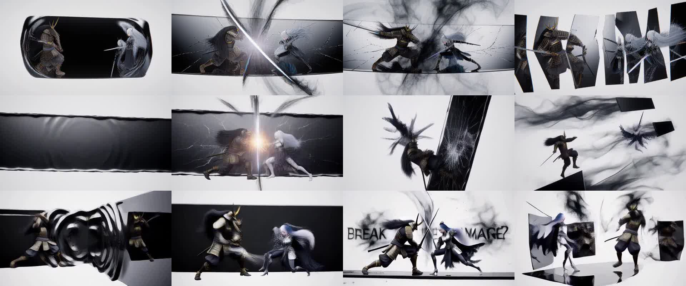

# keys-Mac-TensorFold-MiniMax-H3-MLX

**Thank you to everyone this stands on:** antirez (h3.c), RobZombAI (H3MLX), Ash Hart and the TensorFold
contributors, mrbizarro (minimax-h3-mlx / Phosphene), Apple's MLX team and every MLX contributor, the MiniMax team
(MiniMax H3), NVIDIA Research (Sol-Engine, Sol-Attn, Sol-H3), LightX2V (the Turbo adapter) and FastVideo (FastH3).
This pack is their work, ported, pinned and measured. See [CREDITS.md](CREDITS.md).

**1.0** · Mac Studio M5 Ultra 256 GB · [TensorFold](https://github.com/ashhart/TensorFold) **0.6.5** + an H3 family ·
**MiniMax H3** (FL2VA, bfloat16 weights) · int8 kernels on the M5 tensor units · lightx2v **Turbo** adapter

**A 5 second 864x480 clip with stereo audio in about 50 seconds; 40 seconds at 768x448.** The fastest MiniMax H3
we have measured on Apple Silicon, by a small margin over Phosphene's few-step mode and a large one over the
20-step engines. One-shot install from a GHCR prebuilt carrier.



Rows: antirez h3.c, 20 steps · TensorFold int8, 20 steps · TensorFold Turbo adapter + int8, 3 forwards. Frames 20,
48, 72, 102 of the same prompt. The engines draw different noise for the same seed, so compositions differ.
Clips: [`samples/`](samples/).

## Headline (measured 2026-10-03/04, Mac Studio M5 Ultra 256 GB, macOS 27.0.1)

Test prompt "BLACK MIRROR: FINAL REFLECTION" by @itxabdullaa ([`prompts/`](prompts/)), text-to-video, seed 2077,
124 frames at 24 fps with stereo audio, one render at a time.

### Same Mac, same canvas, same adapter: 768x448, Turbo adapter, 3 forwards

| Engine | Clip time | Denoise | Decode | Note |
|---|---:|---:|---:|---|
| **TensorFold H3 family (this pack)** | **40-41 s** | **21.6-22.3 s** | 8.2 s | wall time from process start, model loaded each run |
| Phosphene 4.17.4 (minimax-h3-mlx `7919020`), bfloat16 | 42-44 s | 31.5 s | 7.6-7.8 s | panel's per-job time; 44-47 s from submit |
| Phosphene, its 8-bit transformer | 43-45 s | 32.7-34.8 s | 7.6-8.1 s | |

Two runs each. The lead is the denoise: 7.1-7.4 s per forward against 10.5 s. Phosphene applies the adapter as a
bfloat16 side branch and TensorFold as int8 weights, so the pictures differ; this compares time, not quality.

### 864x480 against the 20-step engines

| Engine | Steps | Per step | Denoise | Clip time |
|---|---:|---:|---:|---:|
| antirez h3.c `8974cc0` | 20 | 7.85 s | 157 s | 202 s |
| H3MLX `db3cae1` (with local fixes to run on the released weights) | 20 | 7.1 s | 141 s | 153 s |
| TensorFold, bfloat16 | 20 | 13.9 s | 277 s | about 305 s |
| TensorFold, int8 kernels | 20 | 9.3 s | 190 s | 210 s |
| **TensorFold, Turbo adapter + int8 kernels** | **3** | 9.0 s | **27.6 s** | **about 50 s** |

- **Per step, h3.c and H3MLX are still faster than TensorFold** (7.85 and 7.1 s against 9.0-9.3 s). TensorFold's
  clip time comes from running the few-step adapter, which the C engines do not load.
- **Where the 50 s goes:** text encoding 3.1 s, load + adapter merge + int8 quantize 6.2 s, denoise 27.6 s,
  decode 13.3 s (video 11.1 s).
- A 15 second 864x480 clip takes 1,218 s on h3.c and 946 s on H3MLX at 20 steps. It has not been run here.

Raw numbers and method: [`bench/results/RESULTS.md`](bench/results/RESULTS.md).

## What makes it fast

| Piece | Effect at 864x480, 124 frames |
|---|---|
| Turbo adapter, 3 forwards instead of 20 | most of the clip time |
| int8 SwiGLU MLP on the M5 tensor units | 81 ms to 41 ms per block |
| int8 QKV with the q/k norm and RoPE inside the kernel | 46 ms to 22.5 ms per block |
| int8 attention output | 12 ms to 7 ms per block |
| AdaLN tables projected once per run, weights released | 24 GiB freed |
| Adapter merged in float32, quantized straight to int8 | keeps the adapter; a bfloat16 merge loses 15-50% of it |
| int8 kernels in the video decoder | decode 17.3 s to 10.7 s at 47 dB |

Attention itself (93 ms per block, over half of a forward) is MLX's scaled dot-product attention. An int8
flash-style attention kernel was built and measured at parity with it (95.5 ms against 95.8 ms), so it is not used.

## One-shot

```bash
git clone https://github.com/drowzeys/keys-Mac-TensorFold-MiniMax-H3-MLX.git
cd keys-Mac-TensorFold-MiniMax-H3-MLX
brew install python@3.11 uv ffmpeg
bash oneshot-setup.sh
```

`oneshot-setup.sh` does the following:

1. Gets TensorFold 0.6.5 with the H3 family (`drowzeys/TensorFold` at `b8d1682e`), from the **GHCR prebuilt
   carrier** when Docker is available (checksums verified), otherwise from git at the same commit.
2. Installs it with the exact dependency lock ([`requirements.lock`](requirements.lock): mlx 0.32.3, mlx-lm
   0.32.0, mlx-vlm 0.7.4, transformers 5.18.0, …) into its own venv at `~/.local/opt/tensorfold-h3`.
3. Clones minimax-h3-mlx at `79190205` beside it, for the text encoder, audio decoder and MP4 writer.
4. Downloads the MiniMax H3 `FL2VA` partition (**144 GB**) to `~/h3-models/MiniMax-H3` and the Turbo adapter
   (1.96 GB, checksum verified).
5. Renders a 5 second test clip to `outputs/test.mp4`.

Override `PREFIX` or `H3_MODEL_DIR` through the environment. `bash oneshot-setup.sh --verify` checks an existing
install; `--no-render` skips the test clip.

### Render

```bash
bash scripts/generate.sh "A hummingbird hovering over red flowers, soft wing hum" out.mp4
WIDTH=768 HEIGHT=448 SEED=7 bash scripts/generate.sh "..." out.mp4
PROMPT_FILE=prompts/black-mirror-scene.txt SEED=2077 bash scripts/generate.sh "" out.mp4
ADAPTER=none POINTS=21 bash scripts/generate.sh "..." out.mp4          # 20 steps, no adapter
```

`FRAMES` must be `17n + 5` (56, 73, 90, 124, 243, 362); `WIDTH` and `HEIGHT` multiples of 32.

### GHCR prebuilt carrier

```bash
docker pull ghcr.io/drowzeys/keys-mac-tensorfold-minimax-h3-mlx:1.0
# index digest sha256:063d10c78ba8028cbfe1d7c85be6ef0d0b0978fb3cfc1c7fae131469bf42671c (linux/arm64 + linux/amd64)
docker run --rm -v "$PWD":/out ghcr.io/drowzeys/keys-mac-tensorfold-minimax-h3-mlx:1.0 cp -a /payload/. /out/payload/
```

The carrier holds the TensorFold wheel, `requirements.lock`, `h3_generate.py` and `SHA256SUMS`. **It is not a Mac
runtime**: Metal does not run in a container, so `oneshot-setup.sh` installs the payload natively. Rebuild it with
`PUSH=1 bash scripts/build-carrier.sh`.

## Stack

| Piece | Value |
|---|---|
| Host | Mac Studio M5 Ultra, 256 GB, macOS 27.0.1 |
| Engine | TensorFold 0.6.5 (`609ca419`) + one H3 commit, `drowzeys/TensorFold` @ `b8d1682ec315fa4b3649aa4ec9579670a3b89576` (Apache-2.0) |
| Model | `MiniMaxAI/MiniMax-H3`, `FL2VA` partition: 33B transformer (61.7 GiB bfloat16), Qwen3-VL text encoder, video and audio VAEs |
| Adapter | lightx2v MiniMax H3 Turbo v1.0, runner layout as published by Phosphene (sha256 `d51d626f…`) |
| Borrowed at run time | minimax-h3-mlx @ `79190205`: text encoder, audio decoder, MP4 writer |
| MLX | 0.32.3 |
| Peak memory | 103 GB during the adapter merge; 65 GB without an adapter |

## Notes

- **This is a development render path, not a product.** The transformer, sampler, adapters, kernels and video
  decoder are TensorFold's H3 family. The text encoder, audio decoder and MP4 writer are still minimax-h3-mlx's,
  run through `h3_generate.py`. There is no `tensorfold generate` command and no server; the model loads on every
  run.
- **Text-to-video only is measured.** First-frame and reference modes are not wired in this family.
- **Picture quality is not graded.** The transformer equals minimax-h3-mlx's on a real step in bfloat16, and the
  float32 video decode equals its decode. The int8 path does not: a 20-step int8 render keeps the bfloat16
  composition with different detail, and a 3-forward Turbo render in int8 lands on a different composition from
  Turbo in bfloat16. Stills were checked; motion and audio were not reviewed by ear or eye.
- **Turbo is a distilled model.** It gives sharp frames in 3 forwards and sometimes duplicates figures. The
  20-step render without it is closer to what the base model makes.
- **M5 only for these numbers.** The int8 kernels need Metal 4 tensor operations. Without them the family runs
  bfloat16, slower than h3.c.
- **128 GB+ of memory, measured on 256 GB only.**
- **FastH3** (`FastVideo/FastVideo-FastH3-4-step-Preview-v1-LoRA`, `dense-datafree`) is read by the same loader
  (`ADAPTER=…/adapter_model.safetensors POINTS=5`). On the test prompt at 864x480 it took 76 s and looked busier
  than Turbo; it is published for 1344x768, which was not tested.
- **Licence.** MiniMax H3 is under the MiniMax H3 Community License, which excludes some territories. This pack
  ships no weights. Read the licence before downloading them.
- The H3 family is proposed upstream as a draft pull request to TensorFold. It is not part of a TensorFold release.

## Credits

Cite the original authors first: the MiniMax team (MiniMax H3), antirez (h3.c), RobZombAI (H3MLX), mrbizarro
(minimax-h3-mlx, Phosphene), Ash Hart and the TensorFold contributors, NVIDIA Research (Sol-Engine, Sol-Attn,
Sol-H3), LightX2V (Turbo adapter), FastVideo (FastH3), Apple MLX and its contributors, and @itxabdullaa for the
test prompt. Full list: [CREDITS.md](CREDITS.md). Pack: drowzeys / keys.
