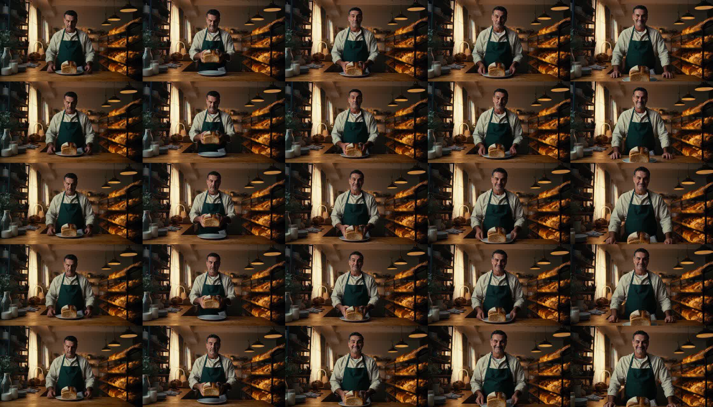

# H3 shootout: four implementations, one image, one prompt

Image to video, 8 seconds, on a Mac Studio M5 Ultra (256 GB, macOS 27.0.1), 2026-10-04. Every engine got the same
first frame ([`baker_base_1344x768.png`](baker_base_1344x768.png)), the same prompt ([`prompt.txt`](prompt.txt)) and
seed 40905090: 192 frames at 24 fps, 1344x768, native stereo audio, one render at a time. Generation time is wall
clock from launch to finished MP4, model load included.

| Entry | Generation time | Steps | Technology | Video quality | Audio quality | Clip |
|---|---:|---:|---|---|---|---|
| **keys TensorFold H3 + Turbo** (this pack) | **357 s (6.0 min)** | 3 | TensorFold (MLX) with int8 Metal kernels, plus the lightx2v Turbo adapter | Sharp (72), most motion, first frame 34.2 dB | Line spoken correctly, 2.4-4.8 s | [mp4](baker_i2v_tensorfold-turbo_1344x768_192f_3fwd_s40905090.mp4) |
| RobZombAI H3MLX `db3cae1` | 1,675 s (27.9 min) | 20 | h3.c fork in C + Metal; second-order solver, int8 MLP, NAX attention; run with three local fixes | Sharpest (82), first frame 32.0 dB | Line spoken correctly, 2.7-5.9 s | [mp4](baker_i2v_h3mlx_1344x768_192f_20st_s40905090.mp4) |
| antirez h3.c `8974cc0` | 2,018 s (33.6 min) | 20 | C + Metal, official bf16 weights, int8 projections at run time | Crisp (68), first frame 33.7 dB | Line spoken correctly, 2.7-5.9 s | [mp4](baker_i2v_h3c_1344x768_192f_20st_s40905090.mp4) |
| keys TensorFold H3 (this pack, no adapter) | 2,106 s (35.1 min) | 20 | TensorFold (MLX), official bf16 weights, int8 Metal kernels for MLP, QKV, attention output and video decoder | Softer (44), first frame 34.9 dB | Line spoken correctly, 2.3-4.8 s | [mp4](baker_i2v_tensorfold_1344x768_192f_20st_s40905090.mp4) |
| mrbizarro minimax-h3-mlx `7919020` | 2,451 s (40.9 min) | 20 | Python + MLX; pruned bf16 transformer, 8-bit text encoder, fp16 VAE | Softer (44), first frame 35.0 dB | Line spoken correctly, 2.3-4.8 s | [mp4](baker_i2v_mrbizarro_1344x768_192f_20st_s40905090.mp4) |

Rows, top to bottom: h3.c, H3MLX, mrbizarro, TensorFold 20 steps, TensorFold Turbo. Face crops at frames 110 and 170:
[`face_crops_f110_f170.png`](face_crops_f110_f170.png).

## Reading the table

- **Like for like, TensorFold is not the fastest.** At 20 steps and this resolution H3MLX wins and h3.c is second;
  TensorFold is third, at 102.7 s per step against h3.c's 93.4 s. TensorFold's 6 minutes come from the Turbo adapter,
  which the C engines do not load.
- **The two C engines are sharper than the two MLX engines at 20 steps.** The number in brackets is a Laplacian edge
  score averaged over 24 frames. Turbo closes most of that gap.
- **All five follow the script.** Each opens on the base image; the baker lifts the loaf, sets it down, looks at the
  camera, smiles, and says "Fresh from the oven. This one's for you."
- **How quality was judged:** stills, face crops, the edge score, the match of the first frame to the base image
  (PSNR after encoding) and speech recognition (Whisper large-v3-turbo) on each audio track. Nobody graded the motion
  by eye or the audio by ear, and lip-sync was not assessed. Watch the clips before relying on the quality columns.
- **Canvas.** The request was 1376x768. h3.c and H3MLX refuse anything above the model's released 768x1344 pixels, so
  the image was cropped by 16 px on each side and all five ran at 1344x768.
- **One seed, one prompt, one run each.** The engines draw different noise for the same seed.

Stage times: h3.c denoise 1,869 s and video decode 133 s; mrbizarro denoise 2,391 s and decode 47 s; TensorFold denoise
2,056 s and decode 39 s; TensorFold Turbo denoise 306 s (102 s per pass) and decode 39 s.

H3MLX ran with three local fixes needed on the released weights: shader registration in `h3_gpu.m`, the audio noise
fill in `h3.c`, and the loudness filter removed in `h3_ffmpeg.c`.

Thanks to antirez, RobZombAI and mrbizarro, whose engines these are. See [CREDITS.md](../CREDITS.md).
